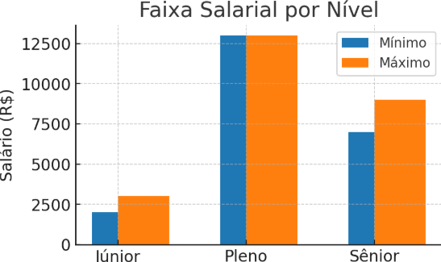
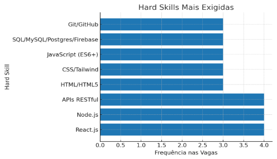
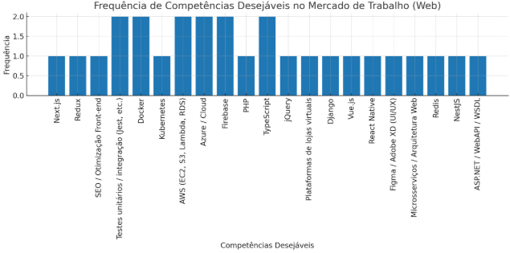
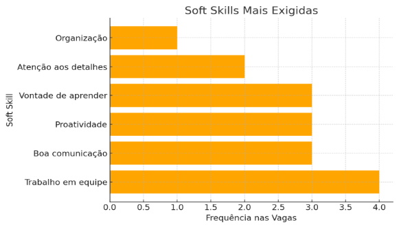

# 🌐 Análise de Competências e Mercado de Trabalho em Desenvolvimento Web

## 📘 Introdução
Este relatório tem como objetivo analisar o mercado de trabalho na área de Desenvolvimento Web, identificando as competências técnicas (**hard skills**) e comportamentais (**soft skills**) mais demandadas. A pesquisa foi realizada em 5 vagas coletadas em plataformas de empregos como Glassdoor. A análise inclui competências exigidas, tendências tecnológicas, faixas salariais e recomendações de desenvolvimento profissional.

## 🔍 Pesquisa de Vagas

| Empresa             | Cargo                         | Localização     | Faixa Salarial         |
|--------------------|-------------------------------|----------------|-----------------------|
| uHero               | Desenvolvedor Front-end Pleno | Barueri - SP   | R$ 13.000             |
| OEmprego – Vagas Brasil | Desenvolvedor Web          | São Paulo - SP | R$ 2.500              |
| LOGSUP Logística    | Desenvolvedor Júnior          | São Paulo - SP | R$ 4.000              |
| Shipeezi            | Desenvolvedor Fullstack Sênior| São Paulo - SP | R$ 7.000 – R$ 9.000   |
| Genius2Work         | Desenvolvedor Fullstack Júnior| Sorocaba - SP  | R$ 2.000 – R$ 3.000   |

### 💰 Faixa Salarial por Nível
  

> 💡 Observação: Há uma diferença significativa na faixa salarial entre Júnior, Pleno e Sênior. O Júnior varia entre R$ 2.000 e R$ 4.000, o Pleno chega até R$ 13.000, e o Sênior alcança aproximadamente R$ 9.000, podendo variar conforme a empresa.
---

## 🛠️ Análise de Competências

### 💻 Hard Skills Mais Exigidas
  

- React.js  
- Node.js  
- APIs RESTful  
- HTML, CSS, JavaScript  
- MySQL/PostgreSQL  
- Git/GitHub  

> ⚡ React.js e Node.js são essenciais para o crescimento profissional. APIs RESTful também são muito requisitadas, sendo fundamentais para a construção de aplicações web modernas.
---

### 🌟 Hard Skills Desejáveis
  

- Next.js  
- Docker  
- AWS  
- TypeScript  
- React Native
- Front-End
  
> 🖱️ Mesmo com frequências diferentes nas vagas pesquisadas, Front-End e TypeScript têm grande importância no mercado.
---

### 🧩 Soft Skills Mais Exigidas
  

- Trabalho em equipe  
- Boa comunicação  
- Proatividade  
- Vontade de aprender  
- Atenção aos detalhes  

> 🤝 Trabalho em equipe e proatividade são essenciais para a colaboração e eficiência em projetos de Desenvolvimento Web.

---

## 🚀 Tendências Tecnológicas
- Cloud Computing  
- Microsserviços  
- Docker e Kubernetes  
- React Native, Vue.js  
- UI/UX (Figma, Adobe XD)  

## 🎯 Plano de Sustentabilidade Profissional
**Hard Skill 1:** JavaScript  
**Hard Skill 2:** React.js  
**Soft Skill:** Proatividade  

**Justificativa:** Escolhi estas competências para aprimorar conhecimentos técnicos e práticos, desenvolver maior percepção para resolução de problemas e fortalecer a proatividade no ambiente profissional.

---

## 📈 Conclusão
As habilidades mais requisitadas pelo mercado de Desenvolvimento Web são **JavaScript, React.js, Node.js, HTML, CSS e APIs RESTful**.  
Entre as tendências tecnológicas emergentes, destacam-se **cloud computing, containers e frameworks modernos**.  
A média salarial para desenvolvedores varia de **R$ 2.000 (Júnior)** até **R$ 13.000 (Pleno)**, enquanto o nível **Sênior** pode variar de **R$ 7.000 a R$ 9.000**, podendo alcançar valores maiores dependendo da empresa e da oportunidade.  
Focar em **JavaScript, React.js e proatividade** oferece um caminho sólido para crescimento profissional consistente 🚀.

---

## 📚 Referências
Vagas coletadas em Glassdoor:  
- [uHero - Desenvolvedor Front-end Pleno](https://www.glassdoor.com.br/job-listing/desenvolvedor-front-end-pleno-uhero-JV_IC2464198_KO0,29_KE30,35.htm?jl=1009830185215)  
- [OEmprego Vagas Brasil - Desenvolvedor Web](https://www.glassdoor.com.br/job-listing/desenvolvedor-web-sao-paulo-oemprego-vagas-brasil-JV_IC2479061_KO0,27_KE28,49.htm?jl=1009835875222)  
- [LOGSUP Logística - Desenvolvedor Júnior](https://www.glassdoor.com.br/job-listing/desenvolvedor-j%C3%BAnior-logsup-logistica-e-transportes-JV_IC2479061_KO0,20_KE21,51.htm?jl=1009836709221)  
- [Shipeezi - Desenvolvedor Fullstack Sênior](https://www.glassdoor.com.br/job-listing/desenvolvedor-fullstack-s%C3%AAnior-shipeezi-JV_IC2479061_KO0,30_KE31,39.htm?jl=1009839690579)  
- [Genius2Work - Desenvolvedor Fullstack Júnior](https://www.glassdoor.com.br/job-listing/desenvolvedor-fullstack-jr-genius2work-servicos-JV_IC2475809_KO0,26_KE27,47.htm?jl=1009839279498)  

**Nome:** David Botta Martins Jalles  
**Local:** São Paulo 
**Data:** 22/08/2025

